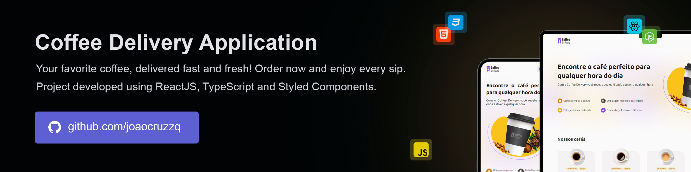

# Coffee Delivery  

Coffee Delivery is your go-to app for a quick and hassle-free coffee experience. Offering a wide variety of freshly brewed coffees, it delivers directly to your door with just a few taps. Enjoy the perfect cup of coffee whenever you need a pick-me-up, with speed and quality you can rely on!

> 🔥 Built with the latest web technologies to ensure fast speed, high performance, and a seamless user experience. It leverages modern tools to deliver a responsive and intuitive interface across devices.



## Running

Follow these steps to run the project locally:

1. Clone the repository:
   ```sh
   git clone https://github.com/joaocruzzq/coffee-delivery.git
   cd ignite-timer
   ```

2. Install dependencies:
   ```sh
   npm install
   ```

3. Run the application:
   ```
   npm run dev
   ```

> Note: Make sure you have <a href="https://nodejs.org/pt">Node.js</a> installed before starting.

## Features

> This application **should be able to**:

- list available products (coffees) for purchase.
- add a specific quantity of coffees to the cart.
- increase or decrease the quantity of items in the cart.
- display the total number of items in the cart in the header.
- calculate and display the total value of the order.

## 🛠️ Technologies Used

| **Technology**           | **Description**                                                   | **Version**  |
|--------------------------|-------------------------------------------------------------------|-------------|
| **React**                | A frontend library for building the user interface.              | 18.3.1      |
| **React Router DOM**     | A library for managing navigation and routing in React.          | 7.1.3       |
| **React Hook Form**      | A library for managing form state and validation in React.       | 7.54.2      |
| **Styled Components**    | A library for styling React components using tagged template literals. | 6.1.14      |
| **Phosphor React**       | A collection of lightweight icons for React applications.        | 1.4.1       |
| **Zod**                  | A TypeScript-first schema validation library.                    | 3.24.1      |
| **Vite**                 | A fast build tool and development server.                         | 6.0.5       |
| **TypeScript**           | A typed superset of JavaScript that provides static types.       | 5.6.2       |
| **@hookform/resolvers**  | A library for integrating external validation schemas with React Hook Form. | 3.10.0      |
